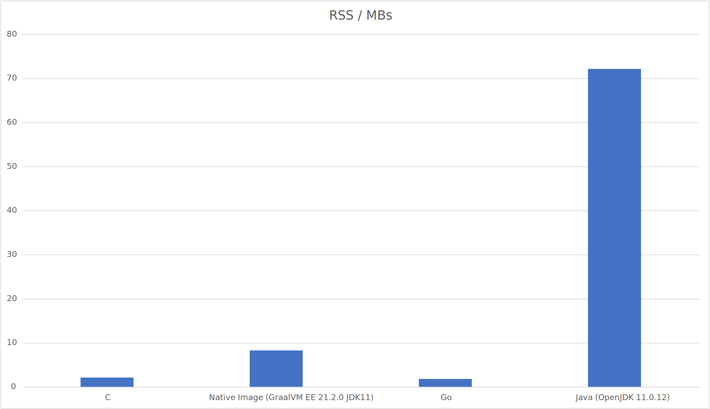

# GraalVM Runtime Performance Against Other Languages / Runtimes Benchmark

A simple benchmarking suite to compare the performance of GraalVM with other languages / runtimes. We will take a fairly simple task, finding primes below some threshold, and use this to create similar implemntations in C, Go & Java. Then we will benchmark the performance of these, looking at total runnning time and max emeory usage (RSS).

For Java we are going to look, in particular, at the performance of OpenJDK and GraalVM Enterprise Edition Native Image.

Let's get started.

## Results of Benchmarking - Sneak Preview

We will shortly go into the detail of the what and the how, but it might be nice to show the results here, first. The benhmark was run on an Oracle Cloud Infrastructure (OCI) linux Virtual Machine, with 1 core and 16 GB of RAM (VM.Standard.E4.Flex), running Oracle Linux 7. 




As you can see from these, for our relatively simple benchmark GraalVM Native Image allows Java programs to approach C-like performance in startup time & big reductions in memory usage.


## Seive of Eratosthenes

A long, long time ago a Greek guy called Eratosthenes, who was actually born in what is Modern day Libya around 276 BCE, came up with an efficient way of calculating the primes, those numbers only divisible by themselves and also by the number 1. 

He was also the first person to calculate the circumfrence of the Earth. Amazingly it turns out he was accurate to within 2.4% and +0.8% of the measurements we have for the circumference of the Earth today (the difference in the accuracies is down to uncertainty around exaxctly how long the Greek unit of measurement, the Satdia, was]!

### How to actually calculate the Primes less than N

We are going to use the algorithm laid out by Eratosthenes as our example workload.  They key to the utility of this algorithm is that it is easier to count & mutiply than to calculate the divisors of a number. The algorithm is explained, far better than I ever could, in [Here - Wikipedia](https://en.wikipedia.org/wiki/Sieve_of_Eratosthenes).

The following is the pseudo code for the algorithm that we are going to use - again this is taken from [Here - Wikipedia](https://en.wikipedia.org/wiki/Sieve_of_Eratosthenes) 

```
algorithm Sieve of Eratosthenes is
    input: an integer n > 1.
    output: all prime numbers from 2 through n.

    let A be an array of Boolean values, indexed by integers 2 to n,
    initially all set to true.
    
    for i = 2, 3, 4, ..., not exceeding √n do
        if A[i] is true
            for j = i2, i2+i, i2+2i, i2+3i, ..., not exceeding n do
                A[j] := false

    return all i such that A[i] is true.
```

## The Languages / Runtimes We Will Benchmark

For the purposes of this benchmark we are going to use languages & runtimes that are know for their efficiency and compare these to Java, and in particular to GraalVM Native Image [for those that don't already know, GraalVM Native Image takes a Java application and generates a fast, efficient native executable from it].

So the languages / runtimes used are going to be:

1. C
2. Go
3. Java 11 (Open JDK)
4. GraalVM Eneterprise Edition Native Image, for JDK 11

## What We Will Benchmark

What we are interested in are:

1. Total running time of the application
2. Resident Set Size, which is a mark of the max memory the application used

Our benchmark, for each language / runtime, will be run against the same maximum upper number (100,000 was chosen for this, rather arbitrarily) 100 times.

## Building the Code

You will need, gcc (recent), Go (1.9.4), some OpenJDK 11, GraalVM Enterprise Edition for JDK11 & GraalVM Enterprise Edition Native Image for JDK11.

### Note on the Need to Switch Between Java Versions

Im using Oracle linux 7, so I have used the package manager to install GraalVM EE & OpenJDK 11. In my build scripts you can see a hack that lets me switch between these alternatives when I need to do the build for OpenJDK. Please remember that you may need to switch back, so check what version of Java you are left as a your default.

## Running the Benchmark

Build everythign first:

```
$ make build
```

Run the benchmarks:

```
$ make bench
```

You can find the results in a file called, `perf-sieve-rss-all.dat`. I've included the contents of a recent run on my machine below, so that you can see what this looks like:

```
C RSS 2183.24
C CLK 0
C CLK_AGGR 0m0.200s
Go RSS 1849.36
Go CLK 0
Go CLK_AGGR 0m0.762s
Native Image RSS 8316.14
Native Image CLK 0
Native Image CLK_AGGR 0m0.273s
Java RSS 72197.8
Java CLK 0.337933
Java CLK_AGGR 0m10.826s
```

To exaplain the format of the rows:

* `C RSS` : this is the average RSS of the C implementation
* `C CLK_AGGR` : The aggregate time for 100 runs of the C code. Divide by 100 to get the run time
* `Go RSS` : this is the average RSS of the Go implementation
* `Go CLK_AGGR` : The aggregate time for 100 runs of the Go code. Divide by 100 to get the run time
* `Native Image RSS` : this is the average RSS of the Native Image implementation
* `Native Image CLK_AGGR` : The aggregate time for 100 runs of the Native Image code. Divide by 100 to get the run time
* `Java RSS` : this is the average RSS of the Java implementation
* `Java CLK_AGGR` : The aggregate time for 100 runs of the Java code. Divide by 100 to get the run time

Note: We need to do 100 runs and do the timing in aggregate as for the C, Go & Native Image code the run times are very small and can not be accuratley measured with `time`. There is timing code within the implementations, but these may not allow for the time that any code that runs prior to the main method uses (sya in the Go / Native Image executables).